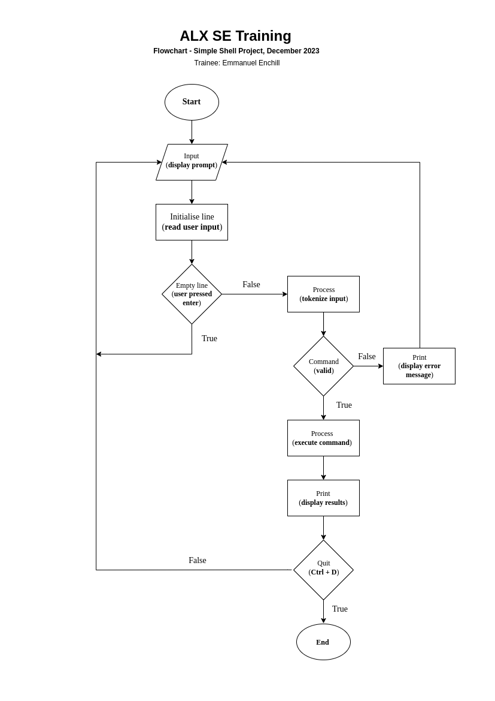

# The Shell
The Shell is a command-line intepreter program that provides an interface between the user and the operating system. This program takes instructions from the keyboard and passes them to the operating system to be executed.

## Flowchart
The following image shows the high level execution flow of this shell program
   

## Issues
This following are the identified issues based on the few test cases done

 Memory Leak 
- There is a base leak of 12 bytes, this given that all commands execute without error at the first run. This is traced by valgrind to the memory allocation by the buildPath() function.
- This value multiplies as more commands are executed continuously in a shell process.
- The **;** command separator and the logic commands, **&&** and **||** fail to execute. The shell produces an error message.
